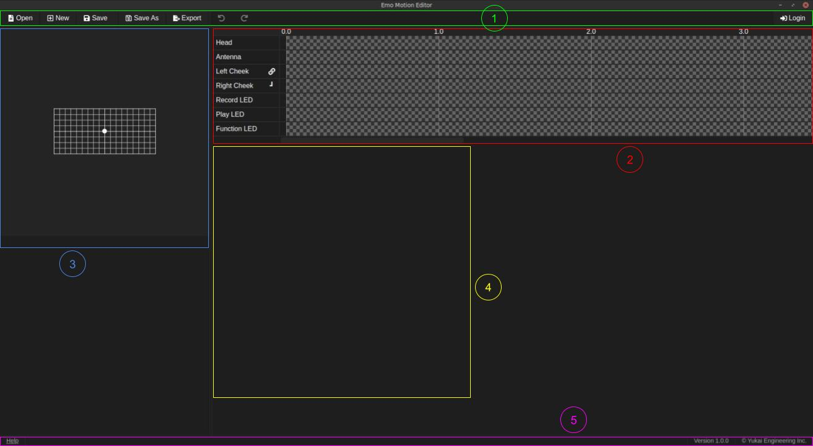

# Emo Motion Editor, How To Use

## Application overview

1. Top panel:
Contains action buttons.
2. Timelines:
Contains each elements timeline.
3. Head canvas:
Contains the motion path for the head.
4. Keyframe settings:
Area for keyframe settings (visible only when a keyframe is selected).
5. Bottom panel:
Contains various information (help window, app version, ...).

## Keyboard keys summary

For MacOS, [Ctrl] is the [Command] key, [Del] is the [delete] key.

### Timeline

- [Del]: Delete a keyframe

### Head canvas

- [Ctrl]+[Left click]: Move a control point
- [Shift]+[Left click]: Move an endpoint without snapping to grid
- [Ctrl]+[Shift]+[Left click]: Move a control point without snapping to grid

## Basic operation

### Keyframe add

### Keyframe deletion

### Timeline selection and keyframe move

### Timelines link/unlink

### Head path

